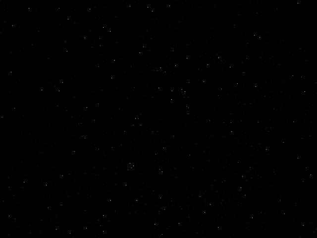
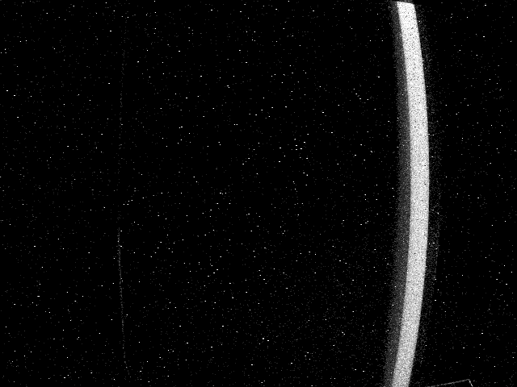
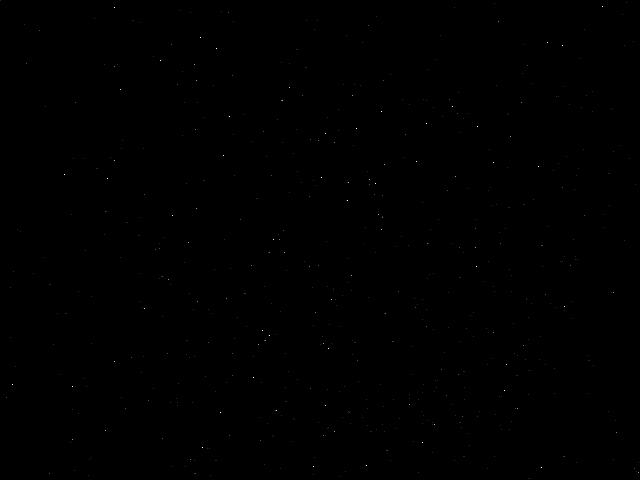
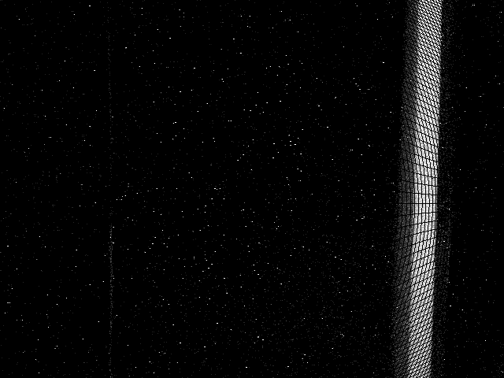

# 📌 Proje Başlığı
**Olay Kamerası Tabanlı Görüntüleme Sistemleri İçin Özgün Kalibrasyon Yöntemi Geliştirilmesi ve Uygulanması**

# 📋 Proje Bilgileri
- **Proje Numarası:** 123E693
- **Proje Yürütücüsü:** Dr. Öğr. Üyesi Gökhan Koray Gültekin
- **Araştırmacı:** Sezgin Dulkadir

---

## 📖 Proje Açıklaması
Bu proje, olay (event-based) kameralar için özel olarak tasarlanmış ve yüksek doğruluk sağlayan yeni bir kalibrasyon yöntemi geliştirmeyi ve uygulamayı amaçlamaktadır. Olay kameralarının, geleneksel kare tabanlı sistemlerden farklı veri çıkışı karakteristikleri dikkate alınarak, hem teorik hem de deneysel çalışmalarla kalibrasyon parametrelerinin iyileştirilmesi hedeflenmektedir.

---

## 📂 Veri Seti
Veri setlerine aşağıdaki bağlantı üzerinden erişebilirsiniz:  
🔗 [Veri Setlerini İndir](https://drive.google.com/drive/folders/1UI78qbMayOxV4bkA0Hq4Af9HcJOcHPHj)

Her bir klasörde şu içerikler bulunmaktadır:
- Ham olay verisi (`.aedat4` veya `.dat` formatında)
- Olay verilerinin .csv formatı

---

## 📷 Kamera Özellikleri
| Özellik                | Değer                                                                                                                                   |
|:----------------------:|:-----------------------------------------------------------------------------------------------------------------------------------------|
| **Mekansal Çözünürlük** | 640 × 480                                                                                                                               |
| **Zamansal Çözünürlük** | 200 µs                                                                                                                                   |
| **Tipik Gecikme**       | < 1 ms                                                                                                                                  |
| **Maksimum Veri Akışı** | 165 MEPS (Milyon Olay/Saniye)                                                                                                           |
| **Dinamik Aralık**      | • ~90 dB (3–100k lüks, %99.9 piksel %27.5 kontrasta tepki)  <br> • ~110 dB (0.3–100k lüks, %50 piksel %80 kontrasta tepki) |
| **Kontrast Hassasiyeti**| • 13% (%50 piksel tepki)  <br> • 27.5% (%99.9 piksel tepki)                                                               |

---

## 📈 Örnek Görselleştirmeler
Aşağıda işlenmiş bazı olay verilerine ait görselleştirme örneklerini bulabilirsiniz:

<table>
  <tr>
    <td align="center">
      <strong>Düzeltilmemiş Olay Verisi</strong><br>
      
      <br>

    </td>
    <td align="center">
      <strong>Düzeltilmiş Olay Verisi</strong><br>
      
      <br>
    </td>
  </tr>
</table>


---

## 📑 Atıf
Bu çalışma veya veri seti kullanıldığında aşağıdaki atıf formatının kullanılması rica olunur:
```bibtex
@misc{event_camera_calibration_123E693,
  title={Olay Kamerası Tabanlı Görüntüleme Sistemleri İçin Özgün Kalibrasyon Yöntemi Geliştirilmesi ve Uygulanması},
  author={Gültekin, Gökhab Koray and Dulkadir, Sezgin},
  year={2025},
  note={Proje No: 123E693}
}
